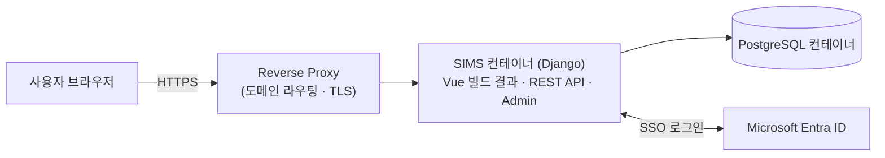
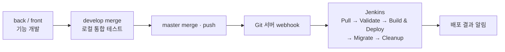

# SIMS — Specification Information Management System

> 사양 정보 관리 시스템 · 농기계 제조사 사내용 제품 사양 통합 조회 시스템


---

## 1. 개요

트랙터·콤바인·이앙기·엔진 등 **본기**와 로더·백호·모어 등 **작업기**의 제품 사양을 하나의 DB로 통합하고, 임직원이 모델·시장별 최신 사양을 웹에서 조회할 수 있게 하는 사내 시스템입니다.

### 해결하려는 문제

| 문제 | 현재 상황 |
|---|---|
| 사양 원본 분산 | 부서·시장별로 관리되는 엑셀 파일 10여 종에 흩어져 있음 |
| 최신본 불명확 | 같은 모델의 수치가 파일마다 다르고, 어느 것이 최신인지 알기 어려움 |
| 다중 모델명 | 같은 제품이 바이어·시장·신구 명칭에 따라 여러 이름으로 판매됨 |
| 표기 불일치 | 단위 혼용(ps/hp, mm/inch), 항목명 언어 혼용(국문/영문), 입력 오류 |
| 변경 추적 불가 | 누가 언제 어떤 값을 바꿨는지 이력이 없음 |

### 목표

- 사양 데이터를 **단일 DB(Single Source of Truth)** 로 통합
- 모델·시장 기준 조회, 모델 간 비교, 단위 자동 변환
- 지정된 데이터 관리자만 수정 가능하고, **모든 변경 이력 기록**
- 사내 SSO(Microsoft 계정) 기반 로그인

---

## 2. 주요 기능 (계획)

- **사양 조회**: 기종 → 모델 → 시장(국내/북미/유럽 등) 순으로 최신 사양 조회
- **모델 비교**: 여러 모델의 사양을 나란히 비교
- **단위 전환**: metric ↔ imperial 즉시 전환 (DB에는 metric만 저장)
- **통합 검색**: 바이어·시장별 다른 모델명으로 검색해도 같은 제품으로 연결
- **적합 정보**: 작업기 ↔ 장착 가능한 트랙터 연결 조회
- **데이터 관리**: 관리자 화면에서 사양 추가·수정, 변경 이력 조회 및 이전 값 복원
- **데이터 이관**: 기존 엑셀 → DB 이관 스크립트 + 오류 검증 리포트

---

## 3. 기술 스택

| 구분 | 기술 | 선택 이유 |
|---|---|---|
| Backend | Python 3.13, Django, Django REST Framework | 사내 표준 프레임워크, Django Admin으로 관리 화면 개발 비용 절감 |
| Frontend | Vue 3, Vite, Vue Router, Pinia, axios | 모델 비교·시장 전환·단위 전환 등 새로고침 없는 상호작용이 핵심 |
| Styling | scoped CSS | 컴포넌트 단위 스타일 격리 |
| Database | PostgreSQL | 다수 사용자 동시 조회, 관계형 사양 데이터 구조에 적합 |
| Auth | django-allauth + Microsoft Entra ID | 사내 계정 SSO, 퇴사 시 계정 비활성화로 접근 자동 차단 |
| Audit | django-simple-history | 변경자·변경 시점·변경 전후 값 기록, Admin에서 복원 가능 |
| Static | WhiteNoise | Vue 빌드 결과를 Django가 직접 서빙 (별도 웹서버 컨테이너 불필요) |
| Data Migration | pandas, openpyxl | 형식이 제각각인 엑셀을 정규화하여 이관 |
| Infra | Docker, Docker Compose, Reverse Proxy | 컨테이너 기반 배포, 도메인·HTTPS는 리버스 프록시에서 일괄 처리 |
| CI/CD | Git 서버 webhook + Jenkins | `master` push 시 자동 빌드·배포 |

---

## 4. 아키텍처



- **컨테이너 2개 구성**: 애플리케이션(Django가 Vue 정적 파일·API·Admin을 함께 제공) + PostgreSQL
- **멀티스테이지 빌드**: Docker 빌드 단계에서 Node로 Vue를 빌드하고, 결과물만 Python 이미지에 복사
  - 장점: 프론트·백엔드 버전이 항상 함께 배포되어 어긋나지 않음, 최종 이미지 경량화
  - 단점: 프론트만 수정해도 전체 이미지 재빌드 필요 (내부용 소규모 서비스라 허용 가능한 수준)
- **포트 비노출**: 애플리케이션 포트는 외부에 열지 않고 리버스 프록시를 통해서만 접근

---

## 5. 개발 · 배포 흐름



| 구간 | 수행 | 비고 |
|---|---|---|
| 개발 → `master` push | 수동 | 운영 환경이 1개이므로 **merge 전 로컬 Docker 통합 테스트가 유일한 검증 단계** |
| push 이후 | 자동 | Jenkins가 이미지 빌드, 컨테이너 교체, DB 마이그레이션, 이미지 정리 수행 |

---

## 6. 프로젝트 구조

```text
SIMS/
├── SIMS-Backend/          # Django + DRF (Admin, 데이터 이관 스크립트 포함)
├── SIMS-Frontend/         # Vue 3 + Vite
├── Dockerfile             # 멀티스테이지 빌드 (Node → Python)
├── docker-compose.yml     # app + PostgreSQL 구성 (비밀값은 .env로 주입)
├── .env.example           # 환경 변수 목록 (값 없음)
├── .dockerignore
├── .gitignore
└── README.md
```

> 배포 파이프라인 스크립트는 저장소가 아닌 Jenkins Job 내부에서 관리합니다.

---

## 7. 데이터 모델 설계 방향

엑셀을 그대로 테이블로 옮기지 않고, 원본 데이터 분석 결과를 바탕으로 구조를 새로 설계합니다.

| 원본 데이터의 특징 | 설계 방향 |
|---|---|
| 기종마다 사양 항목 구성이 완전히 다름 (로더 ≈30개, 트랙터 56개 등) | **사양 항목 자체를 데이터로 관리** (기종별 항목 마스터) → 기종이 늘어도 테이블 구조 변경 불필요 |
| 같은 모델명이어도 시장별로 실제 사양이 다름 | **모델 × 시장** 단위로 사양 세트 저장 |
| 한 제품에 여러 이름 (바이어, 신구 명칭, 옵션 접미사) | **모델명 별칭(alias)** 테이블로 하나의 제품에 연결 |
| 작업기는 특정 트랙터에 장착 | 작업기 ↔ 트랙터 **적합 관계** 테이블 |
| metric·imperial 값을 둘 다 기록 → 서로 어긋남 | **metric만 저장**, imperial은 화면에서 계산 |
| 항목명 국문·영문 혼용 | 항목 마스터에 국문·영문 이름을 함께 정의 |

---

## 8. 권한 설계

| 역할 | 대상 | 권한 | 화면 |
|---|---|---|---|
| 조회자 | 로그인한 전 임직원 | 사양 조회·비교 | Vue |
| 데이터 관리자 | 지정 인원 | 전체 사양 추가·수정 | Django Admin |
| 시스템 관리자 | 개발자 | 전체 + 권한 부여·시스템 설정 | Django Admin |

- Django 기본 **Group** 기능으로 구현 (권한 시스템을 직접 구현하지 않음)
- 변경 이력은 사람이 수정하는 핵심 모델(사양 값, 모델명 별칭)에만 적용해 이력 테이블 증가를 억제
- 엑셀 이관은 `bulk_create_with_history` + **이관 전용 계정**으로 수행해, 이관 데이터와 사람의 수정을 구분

---

## 9. 보안 고려사항

사양 데이터는 대외비이므로, 외부 접근 경로가 열리는 상황까지 전제하고 설계합니다.

- **단일 테넌트 SSO**: 회사 Microsoft 계정만 로그인 허용
- **전 경로 인증 필수**: 조회 화면·API·Admin 모두 로그인 없이 접근 불가
- **비밀값 분리**: DB 비밀번호, SSO Secret 등은 서버의 `.env`로만 관리하고 Git·이미지에 포함하지 않음
- **우회 차단**: 애플리케이션 포트 비노출, `ALLOWED_HOSTS` 제한, 운영 환경 `DEBUG=False`
- **필수 비밀값 검증**: compose에서 `${VAR:?...}` 문법으로 값이 없으면 배포 중단
- **데이터 보호**: 이관 이후 DB가 유일한 원본이 되므로, 오픈 전 정기 백업(`pg_dump`) 구축

---

## 10. 브랜치 전략 · 커밋 컨벤션

소규모(2인) 개발 체계에 맞춰 간소화한 전략을 사용합니다.

| 브랜치 | 용도 |
|---|---|
| `master` | 운영 배포 (push 시 자동 배포). 배포 가능한 상태만 merge |
| `develop` | 통합 개발, 배포 전 로컬 테스트 |
| `front` | 프론트엔드 개발 |
| `back` | 백엔드 개발 |

- `master`, `develop`에 직접 개발하지 않음
- 작업 시작 전 `develop`의 최신 변경사항을 작업 브랜치에 반영
- 긴급 수정은 필요 시 hotfix 브랜치로 유연하게 처리

| 접두어 | 의미 |
|---|---|
| `feature:` | 기능 추가 |
| `fix:` | 오류 수정 |
| `docs:` | 문서 |
| `refactor:` | 로직 개선 |
| `chore:` | 빌드 설정 등 기타 작업 |

---

## 11. 환경 변수

실제 값은 저장소에 포함하지 않습니다. 변수 목록은 `.env.example`을 참고하세요.

| 변수 | 용도 |
|---|---|
| `DJANGO_SECRET_KEY` | Django 암호화 키 |
| `DB_NAME`, `DB_USER`, `DB_PASSWORD`, `DB_HOST`, `DB_PORT` | PostgreSQL 접속 |
| `MS_CLIENT_ID`, `MS_CLIENT_SECRET`, `MS_TENANT_ID`, `MS_REDIRECT_URI` | Microsoft SSO |
| `ALLOWED_HOSTS`, `CSRF_TRUSTED_ORIGINS` | 허용 도메인 제한 |

---

## 12. 로드맵

- [x] 요구사항 정의 및 기술 스택 결정
- [x] 원본 사양 데이터 구조 분석 (엑셀 10여 종)
- [x] 아키텍처·배포 구조 설계 및 검토
- [ ] **Hello SIMS**: 빈 프로젝트로 전체 배포 파이프라인 검증
- [ ] 데이터 모델 설계
- [ ] 엑셀 → DB 이관 스크립트 + 오류 검증 리포트
- [ ] 조회 API (DRF)
- [ ] 조회 화면 (검색, 비교, 시장 전환, 단위 전환)
- [ ] SSO 로그인 · 권한 · 관리 화면 · 변경 이력
- [ ] DB 정기 백업 구축
- [ ] 첫 기종 MVP 오픈
- [ ] 전 기종 확장

---

## 13. 로컬 개발 환경

> Hello SIMS 단계에서 작성 예정

---

## 14. 주요 설계 결정 기록

| 결정 | 대안 | 선택 이유 |
|---|---|---|
| Django + Vue 분리형 | Django 템플릿만 사용 | 비교·전환 중심 UX에 화면 반응성이 중요 |
| 단일 저장소(Monorepo) | 프론트·백엔드 저장소 분리 | 1인 개발 시 기능 하나가 양쪽에 걸쳐도 커밋·배포를 한 번에 처리 |
| 단일 컨테이너 + WhiteNoise | 프론트 전용 Nginx 컨테이너 | 사내 기존 시스템과 동일한 구조로 유지보수 일관성 확보 |
| Django Admin으로 관리 화면 | Vue로 관리 화면 별도 개발 | 수정 인원이 소수라 개발량 대비 이득이 큼 |
| 모델 × 시장 단위 사양 저장 | 기준 사양 + 시장별 차이만 저장(override) | 시장별 실제 차이가 많고, override 구조는 유지보수 복잡도가 높음 |
| metric만 저장 | metric·imperial 모두 저장 | 이중 저장 시 값이 어긋나는 문제가 원본에서 이미 발생 |
| 사내 인프라 관례 준수 | 새로운 최적 구조 도입 | 2인 유지관리 체계에서는 프로젝트 간 일관성이 가장 큰 가치 |

---

## License

Internal project. Source code and data are not for public distribution.
